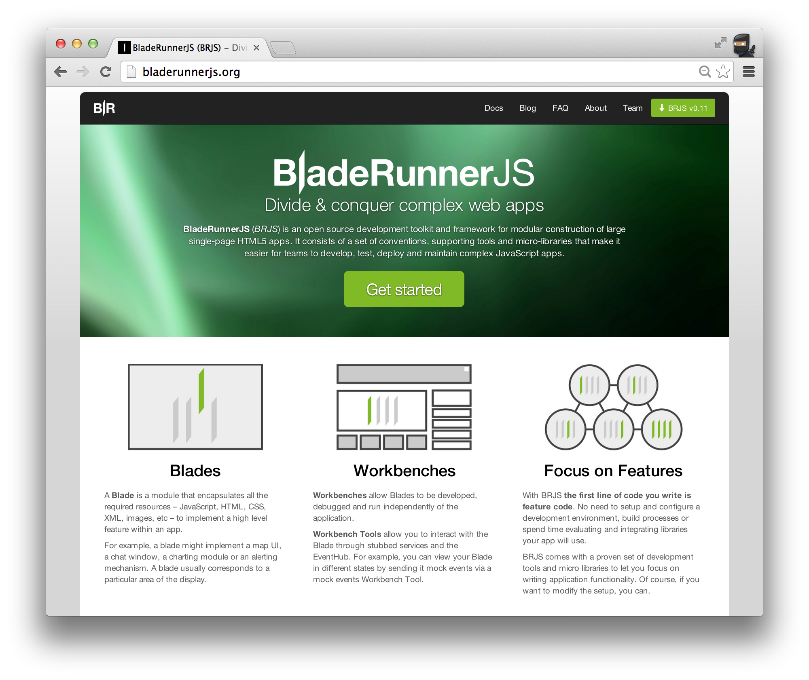
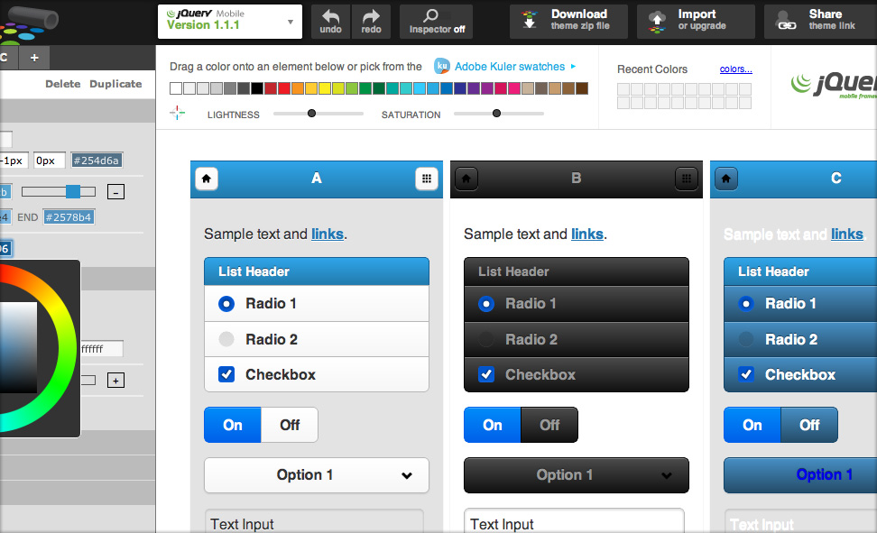
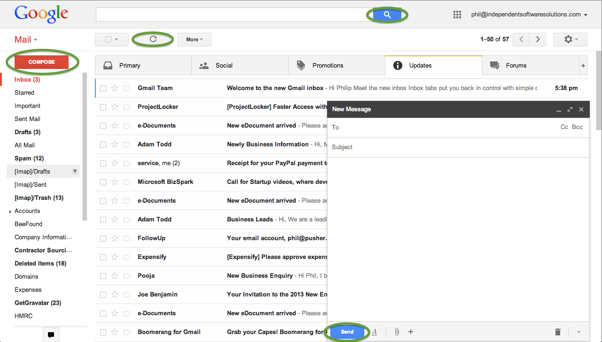
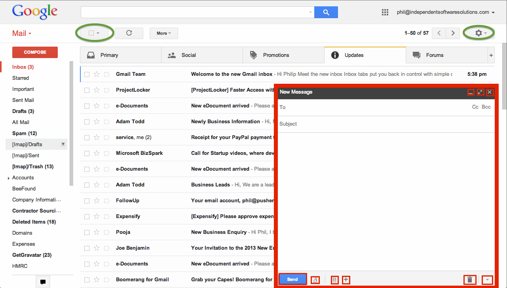
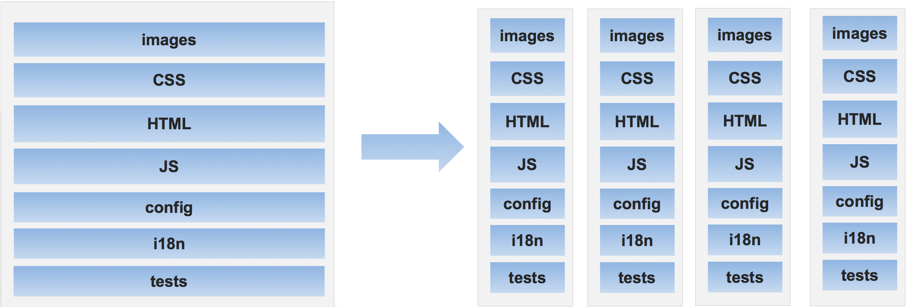
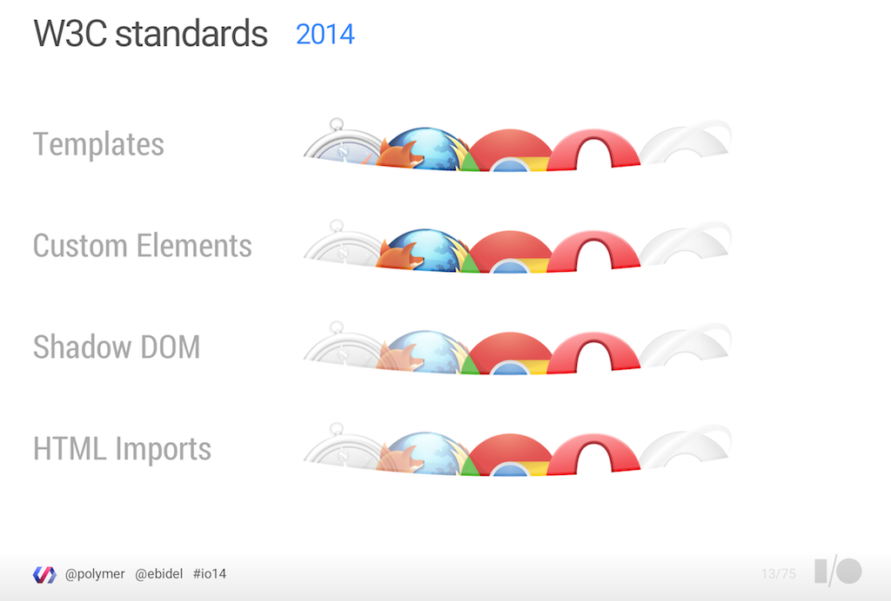
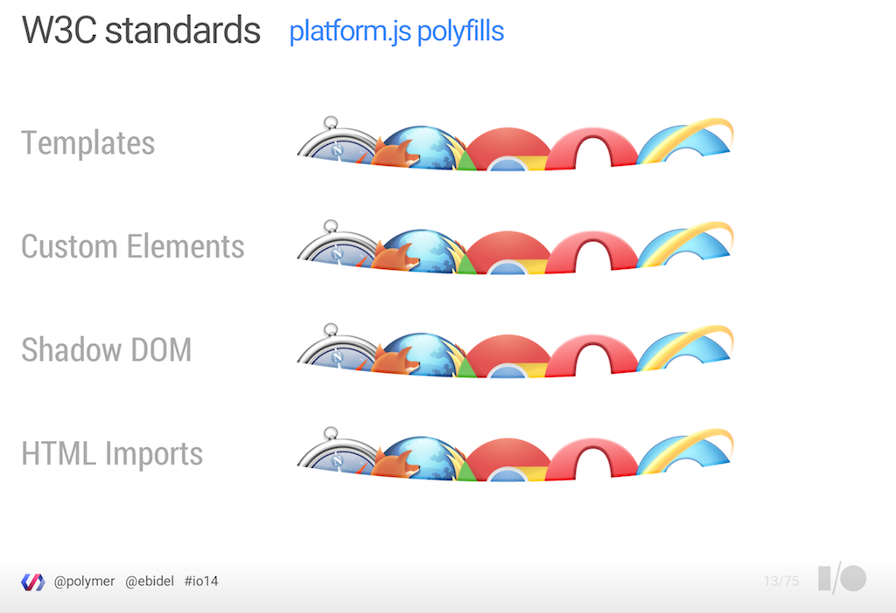
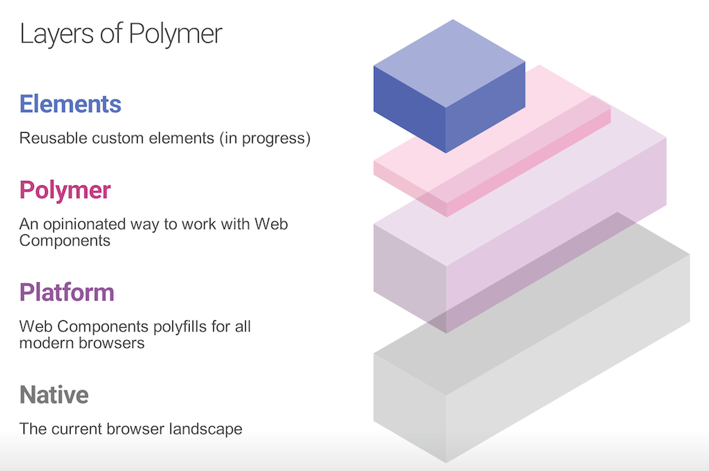

# The State of the
# Componentised Web
<br />
#### Phil [@leggetter](http://www.leggetter.co.uk)

Note:

- Building apps from components: nothing new
- Web Components on the horizon: component-based dev
- Benefits
- Existing technologies
- Future

--



--

<!-- .slide: data-background="img/electronic-components.jpg" data-background-size="100%" data-state="black-bg alpha-bg" class="dark" -->

## What are Components?

* Smaller piece of a larger app
* UI
* Logical unit

Note:

- Semantic Overload

--

#### UI Components



--

#### UI Components - Simple



--

#### UI Components - Composed



--

### Service Components

* XHR/AJAX
* Data Synchronisation
* Logging
* In-App Messaging
* Contacts Service
* Email Service
* Chat Service

--

<!-- .slide: data-background="img/question-mark.jpg" data-background-size="100%" data-state="black-bg alpha-bg" class="dark" -->

## Why Build Components?

--

### Modular

<blockquote>Conceptually, modules represent a <strong>separation of concerns</strong>, and improve <strong>maintainability</strong> by enforcing <strong>logical boundaries</strong> between components. Modules are typically incorporated into the program through <strong>interfaces</strong>... The <strong>implementation</strong> contains the working code that corresponds to the elements declared in the interface.</blockquote>

<small>Source: <a href="http://en.wikipedia.org/wiki/Modular_programming">en.wikipedia.org/wiki/Modular_programming</a></small>

Note:

- Semantic overload again!
- Modules, components, widgets etc.
- Components ~= Modules

--

### High Cohesion

<blockquote>the degree to which the elements of a module belong together</blockquote>
<small>Source: <a href="http://en.wikipedia.org/wiki/Cohesion_(computer_science)">en.wikipedia.org/wiki/Cohesion_(computer_science)</a></small>

Note:

- Arghhhhhh! Software Engineering buzzword bingo!

--

### High Cohesion - Example



Note:

- We can do the same with functionality

--

### Reusable

<!-- .slide: data-background="img/gmail-components.png" data-background-size="100%" data-state="black-bg alpha-bg" class="dark" -->

* DRY
* Consistent UI

--

<!-- .slide: data-background="img/warning.png" data-background-size="100%" data-state="black-bg alpha-bg" class="dark" -->

### Don't over-engineer to achieve reusability

Note:

Don't focus too much on trying to build reusable components. Focus on building the required piece of functionality for your application, which may be very specific. Then, if the need arises, or it becomes very clear that the component is reusable, put in the extra effort to make the component reusable. As developers love to create reusable functionality (libraries, components, modules, plugins etc.). Doing so prematurely can result in a world of pain. So, take all the other benefits of component-based development and accept that not everything you write can be 100% reusable.

--

### Interchangable

* Same interface/contract
* Same functionality
* Swap easily

Note:

A nice and focused component API presents the opportunity to be able to easily change the underlying implementation. Or, if the components within the application are loosely coupled you can actually completely swap one component for another as long as they offer the same API/interface/contract.

For example, if you were to use a service component that offered realtime functionality via GoInstant, the news this week that they're closing down would probably be a bit of shock. However, you could quite feasibly create and use a FirebaseComponent or PubNubComponent as long as they offer the same data synchronisation-focused API.

--

#### Composable


Note:

As previously discussed, a component-based architecture makes it easy for one component to be composed of a number of other components. This allows the component to stay focused and benefit from reusing functionality already build and exposed in other components.

More complex functionality can be built in this way; from richer application features to full applications. It's one of the main benefits of this approach.

Whether absolutely everything should be a component is really up to you. There's no reason why your application can't be a my-app component which is then composed of my-awesome-feature and my-fabulous-features. And those components are then in turn composed of other components. If you see benefits from this approach then by all means stick with it. However, be careful not to over complicate things in the same way that you shouldn't focus too hard on making a component reusable. Focus on delivering application functionality.

--

### Building Components Now


Note:

- Some libraries/frameworks provide in-build component support
- Demonstrate building components using most popular

--

## `my-avatar` Component Example

```html
  <my-avatar service="twitter" username="leggetter" />
```

--

### Angular

<a class="jsbin-embed" href="http://jsbin.com/lacog/2/embed?html,output">JS Bin</a>

--

### Ember


<a class="jsbin-embed" href="http://jsbin.com/nawuwi/4/embed?html,output">JS Bin</a>

--

### React

<a class="jsbin-embed" href="http://jsbin.com/qigoz/5/embed?html,output">JS Bin</a>

--

### ReactiveElements

<a class="jsbin-embed" href="http://jsbin.com/qigoz/7/embed?html,output">JS Bin</a>

--

## The Future:
## Web Components & Beyond


--

* Custom Elements
* Shadow DOM
* HTML Imports
* Templates

--



--



--

### Platform.js

<a class="jsbin-embed" href="http://jsbin.com/pihuz/4/embed?html,output">JS Bin</a>

--

## Other Polyfills

* [bosonic](http://bosonic.github.io/)
* [W3C Custom Elements Polyfil](https://github.com/WebReflection/document-register-element#document-register-element)
* [X-Tag](https://github.com/x-tag/x-tag) <small>(includes some other "core" components)</small>

--



--

### Polymer - Example

<a class="jsbin-embed" href="http://jsbin.com/gukoku/2/embed?html,output">JS Bin</a>

--

### X-Tag & Brick

<a class="jsbin-embed" href="http://jsbin.com/wexiz/2/embed?html,output">JS Bin</a>

Note:

- X-Tag - similar to Platform.js
- Brick - a set of components to build apps with

--

## Component Inter-Communication

##### ComponentX

```js
var ServiceRegistry = require( 'br/ServiceRegistry' )
var eventHub = ServiceRegistry.getService( 'br.event-hub' );
eventHub.channel( 'foo' ).trigger( 'bar', { some: 'data' } );
```
##### ComponentY

```js
var ServiceRegistry = require( 'br/ServiceRegistry' )
var eventHub = ServiceRegistry.getService( 'br.event-hub' );
eventHub.channel( 'foo' ).bind( 'bar', function( data ) {
  // handle event
}, this );
```

Note:

- "independent" and "modular" how do they communicate?
- directly reference each other and interact via their API?!
- loose coupling where components have little or no knowledge of each other
- Use services
- Angular and Ember use services & DI

--

## Conclusion

* Components = Benefits
* Existing libs/frameworks - Components
* Native Web Components = Future
* Build new libs/frameworks on new foundation
* Existing libs/frameworks will align


Note:

There are lots of benefits to building applications with component-based architectures and you can tell from the approach that existing frameworks have taken and from Web Components that it's recommended when building front-end web apps.

This whirlwind tour of the State of the Componentised Web has likely added to the weight of choice we developers already have when it comes to frameworks and tooling. But, Web Components may be the light at the end of the tunnel!

Web Components will provide a native and unified way of building applications. Existing frameworks will likely move to use Web Components or demonstrate how they can be used alongside them. Ember's strategy is to make it easy to migrate to Web Components and Facebook's React is a good example of where integration is most likely - there's already a ReactiveElements that demonstrates this. Since Angular and Polymer are Google projects it's also highly likely that these two projects will align.

--

# Thanks!
# Questions?
<br />
#### Phil [@leggetter](http://www.leggetter.co.uk)
#### [BladeRunnerJS](http://bladerunnerjs.org)
<br />
#### [j.mp/realtime-sotr14](http://j.mp/realtime-sotr14)
